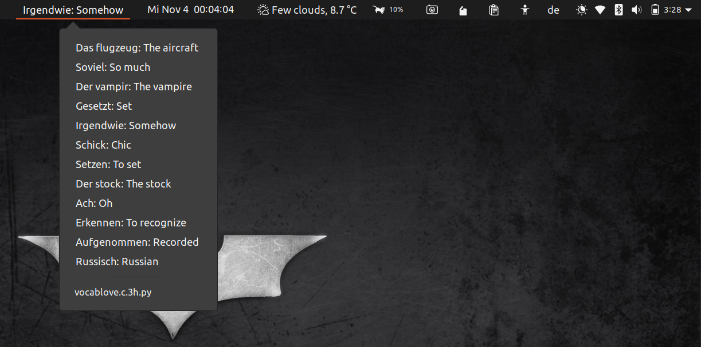

# vocablove

GNOME Shell extension to learn and practice vocabulary. Gets [Random German Words](https://www.bestrandoms.com/random-german-words) and displays the words with meaning repeatedly until the script gets executed again to get new set of words. 

Since the website generates 6 words at a time, the script displays a maximum of 12 words in a loop, one at a time, until the script gets executed again, based on your choice. Default is 3 hours. You can refresh the words list manually if you know/learned them all or for whatever reason.

## How to Install?

**Dependencies:**

* [Argos](https://github.com/rammie/argos/tree/gnome-3.36) (Install gnome-3.36 branch)
* [Python 3](https://www.python.org/)

It's fairly simple to install this extension. After installing **Argos,**  copy the above python script to `~/.config/argos` and make the file executable by `chmod +x vocablove.c.3h.py ` . File name follows the Argos recommended filename format 

```
NAME.POSITION.INTERVAL[+].EXTENSION
```

Once the script is executable, you should be able to see the words on the top panel.

### How to make changes?

+ By default, the word changes every 3 seconds. I think this is too fast, especially when it's a new word. You can change the interval easily, by just changing it in the source code of [Argos](https://github.com/rammie/argos/tree/gnome-3.36). Go to the `argos@pew.worldwidemann.com/buttons.js` file in `argos` and change the seconds from **3** to **7** (recommend) or more in line 151 `this._cycleTimeout = Mainloop.timeout_add_seconds(3, Lang.bind(this, function()`.
+ Available positions: `l | c | r`. You can change the position by changing the file name.
+ Depending on your speed of learning and the amount of time you spend on screen, you can change the frequency of script execution. Available intervals:  number+`s | h | d | y` .You can change the frequency of script execution by changing the file name accordingly. Ex: 2d means the word list gets refreshed every 2 days.

### Sample output



## To Do

- [ ] Reduce the speed of change directly from extension
- [ ] Add more languages
- [ ] Add option to select between languages
- [x] Option to refresh word list
- [ ] Increase/Decrease number of words
- [ ] Add multiple sources to get the random words (online, local files)
- [ ] Save words to a local text file
- [ ] Add check box for learned words and save them to a local text file

## Thanks to

* Contributers of [Argos](https://github.com/rammie/argos/tree/gnome-3.36)
* Makers of [Random-German_words](https://www.bestrandoms.com/random-german-words)