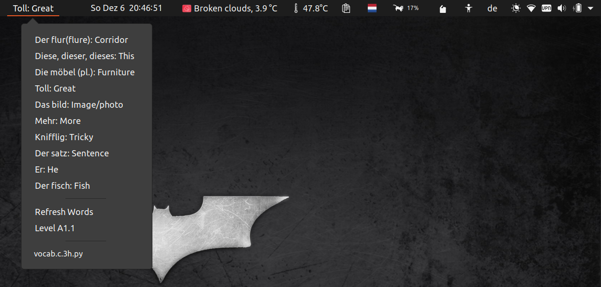

# vocablove

GNOME Shell extension to learn and practice vocabulary. Gets the words from a local `.csv` file in `word_sources/` folder and displays the words with meaning repeatedly until the script gets executed again to get new set of words.

Since **Argos** does not allow to select particular method from the script to execute from the shell, so you will see random words(default 10) at a time from a language level(A1.1, A1.2, ... C1)

### Number of words

* A1.1 (586)
* A1.2 (533)
* A2.1 (479)
* A2.2 (563)

The script gets executed automatically every 3 hours. You can refresh the words list manually if you know/learned them all or for whatever reason. Every time you refresh the word list, the language level also gets refreshed. That mean you can learn words from different levels in parallel.

## How to Install and Use?

**Dependencies:**

* [Argos](https://github.com/rammie/argos/tree/gnome-3.36) (Install gnome-3.36 branch)
* [Python 3](https://www.python.org/)

It's fairly simple to install this extension. After installing **Argos,**  copy the python script and the `word_sources/`  to `~/.config/argos` and make the file executable with `chmod +x vocablove.c.3h.py ` . File name follows the Argos recommended filename format if you want to change it.

```
NAME.POSITION.INTERVAL[+].EXTENSION
```

Once the script is executable, you should be able to see the words on the top panel.

### How to make changes?

+ By default, the word changes every 3 seconds. I think this is too fast, especially when it's a new word. You can change the interval easily, by just changing it in the source code of [Argos](https://github.com/rammie/argos/tree/gnome-3.36). Go to the `argos@pew.worldwidemann.com/buttons.js` file in `argos` and change the seconds from **3** to **7** (recommend) or more in line 151 `this._cycleTimeout = Mainloop.timeout_add_seconds(3, Lang.bind(this, function()`.
+ Available positions: `l | c | r`. You can change the position by changing the file name.
+ Depending on your speed of learning and the amount of time you spend on screen, you can change the frequency of script execution. Available intervals:  number+`s | h | d | y` .You can change the frequency of script execution by changing the file name accordingly. Ex: `vocablove.c.2d.py...`  means the word list gets refreshed every 2 days.

### Extension Screenshot



## Troubleshooting

If you just see `vocablove.c.3h.py...`  instead of some words in the top panel, restarting the GNOME shell by `Alt+F2` and then type `r` usually solves the problem. If the problem persists, you probably have to do your own diagnostics. 

**hint:** Check if you have installed a working copy of Argos or not.

## Contributing

If you would like improve the extension is any way, feel free to open an issue. I'm always open to new ideas. I did not use an OCR engine and some automated script to create the `.csv` files for words. I manually entered/copy-pasted(it was a good practice) the words so there could be some mistakes in the words. Feel free to open an Issue first and then a PR if you want to contribute.

The words are in the following format in the `.csv` file. Plural if it's a noun.

```
Word(Plural): Meaning
```

## To Do

- [ ] Add option to select between language levels
- [ ] Reduce the speed of change directly from extension
- [ ] Add more languages
- [ ] Add option to select between languages
- [x] Deprecate the methods related to online words to use only local words
- [x] Option to refresh word list
- [x] Add multiple sources to get the random words (online, local files)
- [ ] ~~Add check box for learned words and save them to a local text file~~
- [ ] ~~Save words to a local text file~~
- [ ] ~~Increase/Decrease number of words~~

## Thanks to

* Contributers of [Argos](https://github.com/rammie/argos/tree/gnome-3.36)
* [telc GmbH](https://www.telc.net/) for the vocab files for each language level

## About LICENSE

I created this extension for personal use. The extension [LICENSE](LICENSE) is only valid for the code. Since the words are fetched from an external source, i do not own that data. I would suggest you to not use the extension for any commercial purpose, unless you have the permission to do so from those respective data sources.

[Go UP⬆️](#vocablove)

